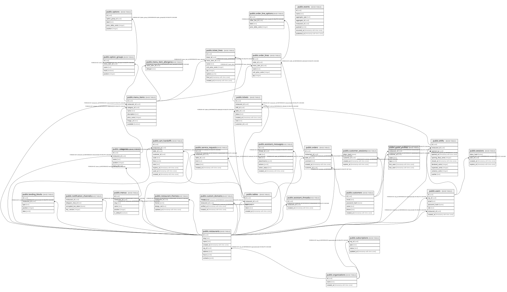

# aivo

## Tables

| Name | Columns | Comment | Type |
| ---- | ------- | ------- | ---- |
| [public.restaurants](public.restaurants.md) | 8 |  | BASE TABLE |
| [public.tables](public.tables.md) | 5 |  | BASE TABLE |
| [public.categories](public.categories.md) | 5 |  | BASE TABLE |
| [public.menu_items](public.menu_items.md) | 8 |  | BASE TABLE |
| [public.menu_item_allergens](public.menu_item_allergens.md) | 2 |  | BASE TABLE |
| [public.option_groups](public.option_groups.md) | 5 |  | BASE TABLE |
| [public.options](public.options.md) | 5 |  | BASE TABLE |
| [public.orders](public.orders.md) | 6 |  | BASE TABLE |
| [public.order_lines](public.order_lines.md) | 6 |  | BASE TABLE |
| [public.order_line_options](public.order_line_options.md) | 4 |  | BASE TABLE |
| [public.service_requests](public.service_requests.md) | 6 |  | BASE TABLE |
| [public.landing_blocks](public.landing_blocks.md) | 5 |  | BASE TABLE |
| [public.notification_channels](public.notification_channels.md) | 4 |  | BASE TABLE |
| [public.menus](public.menus.md) | 6 |  | BASE TABLE |
| [public.cart_handoffs](public.cart_handoffs.md) | 10 |  | BASE TABLE |
| [public.organizations](public.organizations.md) | 3 |  | BASE TABLE |
| [public.users](public.users.md) | 7 |  | BASE TABLE |
| [public.sessions](public.sessions.md) | 4 |  | BASE TABLE |
| [public.subscriptions](public.subscriptions.md) | 4 |  | BASE TABLE |
| [public.restaurant_themes](public.restaurant_themes.md) | 4 |  | BASE TABLE |
| [public.custom_domains](public.custom_domains.md) | 4 |  | BASE TABLE |
| [public.assistant_threads](public.assistant_threads.md) | 3 |  | BASE TABLE |
| [public.assistant_messages](public.assistant_messages.md) | 8 |  | BASE TABLE |
| [public.customers](public.customers.md) | 6 |  | BASE TABLE |
| [public.customer_sessions](public.customer_sessions.md) | 4 |  | BASE TABLE |
| [public.guest_profiles](public.guest_profiles.md) | 6 |  | BASE TABLE |
| [public.shifts](public.shifts.md) | 10 |  | BASE TABLE |
| [public.tickets](public.tickets.md) | 8 |  | BASE TABLE |
| [public.ticket_lines](public.ticket_lines.md) | 9 |  | BASE TABLE |
| [public.events](public.events.md) | 8 |  | BASE TABLE |

## Relations

---

> Generated by [tbls](https://github.com/k1LoW/tbls)
