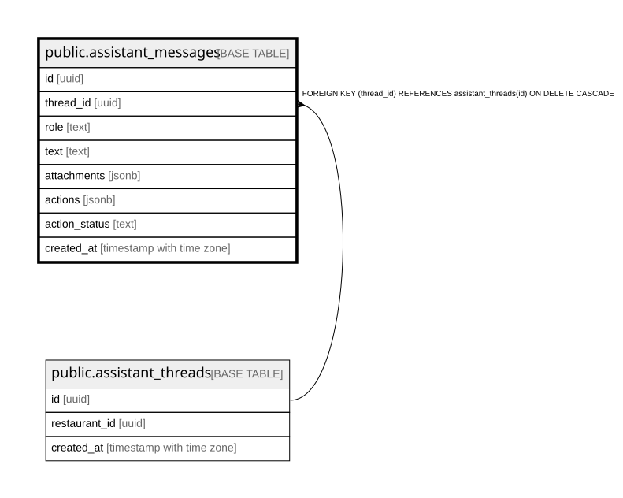

# public.assistant_messages

## Columns

| Name | Type | Default | Nullable | Children | Parents | Comment |
| ---- | ---- | ------- | -------- | -------- | ------- | ------- |
| id | uuid |  | false |  |  |  |
| thread_id | uuid |  | false |  | [public.assistant_threads](public.assistant_threads.md) |  |
| role | text |  | false |  |  |  |
| text | text | ''::text | false |  |  |  |
| attachments | jsonb | '[]'::jsonb | false |  |  |  |
| actions | jsonb | '[]'::jsonb | false |  |  |  |
| action_status | text |  | true |  |  |  |
| created_at | timestamp with time zone | now() | false |  |  |  |

## Constraints

| Name | Type | Definition |
| ---- | ---- | ---------- |
| assistant_messages_thread_id_fkey | FOREIGN KEY | FOREIGN KEY (thread_id) REFERENCES assistant_threads(id) ON DELETE CASCADE |
| assistant_messages_pkey | PRIMARY KEY | PRIMARY KEY (id) |

## Indexes

| Name | Definition |
| ---- | ---------- |
| assistant_messages_pkey | CREATE UNIQUE INDEX assistant_messages_pkey ON public.assistant_messages USING btree (id) |
| assistant_messages_thread_idx | CREATE INDEX assistant_messages_thread_idx ON public.assistant_messages USING btree (thread_id, created_at) |

## Relations

---

> Generated by [tbls](https://github.com/k1LoW/tbls)
