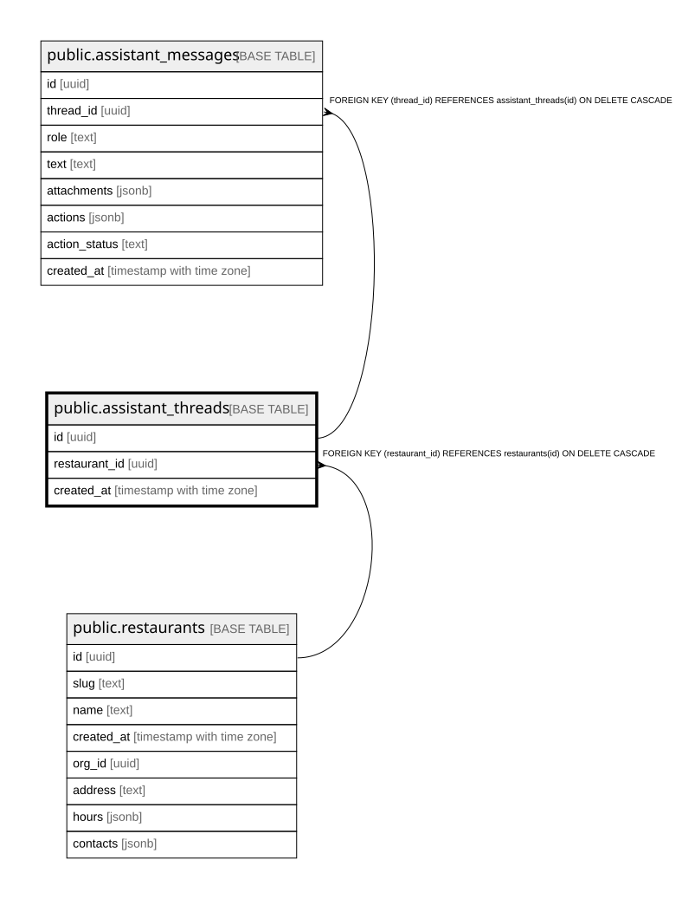

# public.assistant_threads

## Columns

| Name | Type | Default | Nullable | Children | Parents | Comment |
| ---- | ---- | ------- | -------- | -------- | ------- | ------- |
| id | uuid |  | false | [public.assistant_messages](public.assistant_messages.md) |  |  |
| restaurant_id | uuid |  | false |  | [public.restaurants](public.restaurants.md) |  |
| created_at | timestamp with time zone | now() | false |  |  |  |

## Constraints

| Name | Type | Definition |
| ---- | ---- | ---------- |
| assistant_threads_restaurant_id_fkey | FOREIGN KEY | FOREIGN KEY (restaurant_id) REFERENCES restaurants(id) ON DELETE CASCADE |
| assistant_threads_pkey | PRIMARY KEY | PRIMARY KEY (id) |

## Indexes

| Name | Definition |
| ---- | ---------- |
| assistant_threads_pkey | CREATE UNIQUE INDEX assistant_threads_pkey ON public.assistant_threads USING btree (id) |
| assistant_threads_restaurant_idx | CREATE UNIQUE INDEX assistant_threads_restaurant_idx ON public.assistant_threads USING btree (restaurant_id) |

## Relations

---

> Generated by [tbls](https://github.com/k1LoW/tbls)
