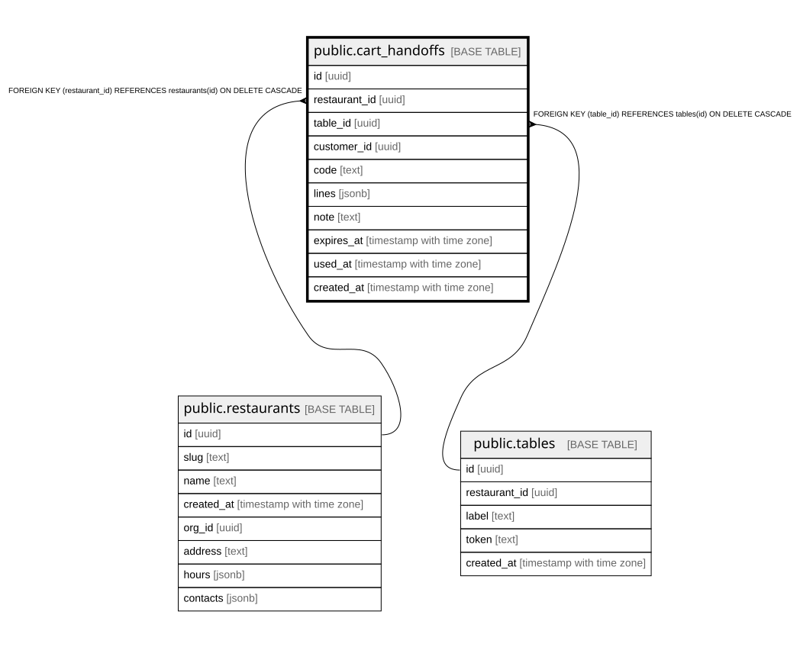

# public.cart_handoffs

## Columns

| Name | Type | Default | Nullable | Children | Parents | Comment |
| ---- | ---- | ------- | -------- | -------- | ------- | ------- |
| id | uuid |  | false |  |  |  |
| restaurant_id | uuid |  | false |  | [public.restaurants](public.restaurants.md) |  |
| table_id | uuid |  | false |  | [public.tables](public.tables.md) |  |
| customer_id | uuid |  | true |  |  |  |
| code | text |  | false |  |  |  |
| lines | jsonb |  | false |  |  |  |
| note | text | ''::text | false |  |  |  |
| expires_at | timestamp with time zone |  | false |  |  |  |
| used_at | timestamp with time zone |  | true |  |  |  |
| created_at | timestamp with time zone | now() | false |  |  |  |

## Constraints

| Name | Type | Definition |
| ---- | ---- | ---------- |
| cart_handoffs_restaurant_id_fkey | FOREIGN KEY | FOREIGN KEY (restaurant_id) REFERENCES restaurants(id) ON DELETE CASCADE |
| cart_handoffs_table_id_fkey | FOREIGN KEY | FOREIGN KEY (table_id) REFERENCES tables(id) ON DELETE CASCADE |
| cart_handoffs_pkey | PRIMARY KEY | PRIMARY KEY (id) |

## Indexes

| Name | Definition |
| ---- | ---------- |
| cart_handoffs_pkey | CREATE UNIQUE INDEX cart_handoffs_pkey ON public.cart_handoffs USING btree (id) |
| cart_handoffs_code_active_idx | CREATE UNIQUE INDEX cart_handoffs_code_active_idx ON public.cart_handoffs USING btree (code) WHERE (used_at IS NULL) |
| cart_handoffs_table_idx | CREATE INDEX cart_handoffs_table_idx ON public.cart_handoffs USING btree (table_id) |

## Relations

---

> Generated by [tbls](https://github.com/k1LoW/tbls)
