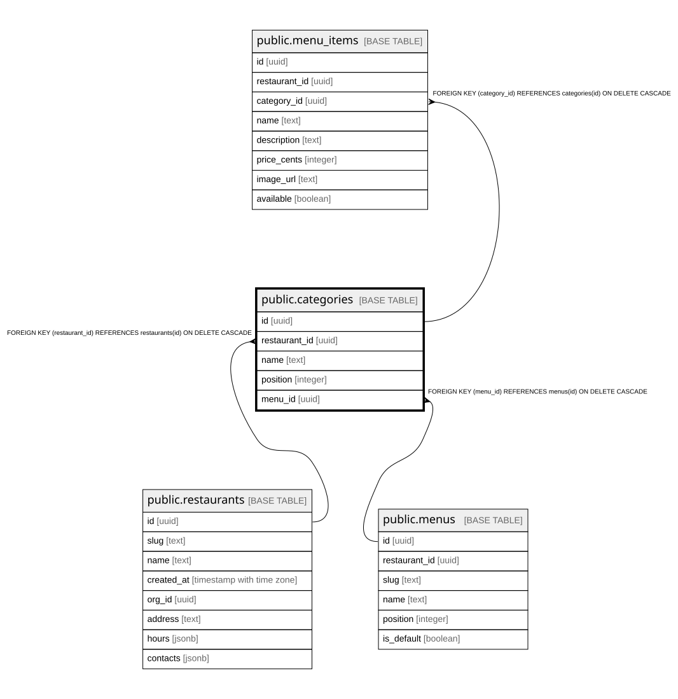

# public.categories

## Columns

| Name | Type | Default | Nullable | Children | Parents | Comment |
| ---- | ---- | ------- | -------- | -------- | ------- | ------- |
| id | uuid |  | false | [public.menu_items](public.menu_items.md) |  |  |
| restaurant_id | uuid |  | false |  | [public.restaurants](public.restaurants.md) |  |
| name | text |  | false |  |  |  |
| position | integer | 0 | false |  |  |  |
| menu_id | uuid |  | false |  | [public.menus](public.menus.md) |  |

## Constraints

| Name | Type | Definition |
| ---- | ---- | ---------- |
| categories_restaurant_id_fkey | FOREIGN KEY | FOREIGN KEY (restaurant_id) REFERENCES restaurants(id) ON DELETE CASCADE |
| categories_pkey | PRIMARY KEY | PRIMARY KEY (id) |
| categories_menu_id_fkey | FOREIGN KEY | FOREIGN KEY (menu_id) REFERENCES menus(id) ON DELETE CASCADE |

## Indexes

| Name | Definition |
| ---- | ---------- |
| categories_pkey | CREATE UNIQUE INDEX categories_pkey ON public.categories USING btree (id) |
| categories_restaurant_id_idx | CREATE INDEX categories_restaurant_id_idx ON public.categories USING btree (restaurant_id) |
| categories_menu_id_idx | CREATE INDEX categories_menu_id_idx ON public.categories USING btree (menu_id) |

## Relations

---

> Generated by [tbls](https://github.com/k1LoW/tbls)
