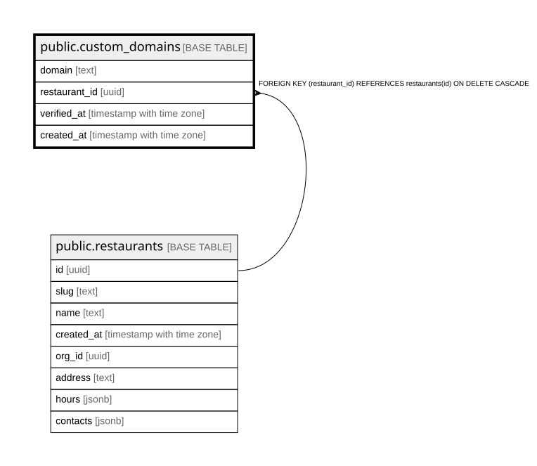

# public.custom_domains

## Columns

| Name | Type | Default | Nullable | Children | Parents | Comment |
| ---- | ---- | ------- | -------- | -------- | ------- | ------- |
| domain | text |  | false |  |  |  |
| restaurant_id | uuid |  | false |  | [public.restaurants](public.restaurants.md) |  |
| verified_at | timestamp with time zone |  | true |  |  |  |
| created_at | timestamp with time zone | now() | false |  |  |  |

## Constraints

| Name | Type | Definition |
| ---- | ---- | ---------- |
| custom_domains_restaurant_id_fkey | FOREIGN KEY | FOREIGN KEY (restaurant_id) REFERENCES restaurants(id) ON DELETE CASCADE |
| custom_domains_pkey | PRIMARY KEY | PRIMARY KEY (domain) |

## Indexes

| Name | Definition |
| ---- | ---------- |
| custom_domains_pkey | CREATE UNIQUE INDEX custom_domains_pkey ON public.custom_domains USING btree (domain) |
| custom_domains_restaurant_id_idx | CREATE INDEX custom_domains_restaurant_id_idx ON public.custom_domains USING btree (restaurant_id) |

## Relations

---

> Generated by [tbls](https://github.com/k1LoW/tbls)
