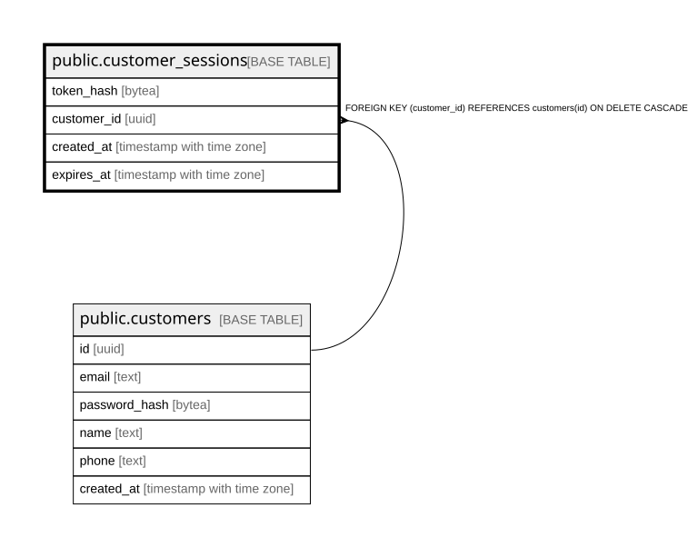

# public.customer_sessions

## Columns

| Name | Type | Default | Nullable | Children | Parents | Comment |
| ---- | ---- | ------- | -------- | -------- | ------- | ------- |
| token_hash | bytea |  | false |  |  |  |
| customer_id | uuid |  | false |  | [public.customers](public.customers.md) |  |
| created_at | timestamp with time zone | now() | false |  |  |  |
| expires_at | timestamp with time zone |  | false |  |  |  |

## Constraints

| Name | Type | Definition |
| ---- | ---- | ---------- |
| customer_sessions_customer_id_fkey | FOREIGN KEY | FOREIGN KEY (customer_id) REFERENCES customers(id) ON DELETE CASCADE |
| customer_sessions_pkey | PRIMARY KEY | PRIMARY KEY (token_hash) |

## Indexes

| Name | Definition |
| ---- | ---------- |
| customer_sessions_pkey | CREATE UNIQUE INDEX customer_sessions_pkey ON public.customer_sessions USING btree (token_hash) |
| customer_sessions_customer_idx | CREATE INDEX customer_sessions_customer_idx ON public.customer_sessions USING btree (customer_id) |

## Relations

---

> Generated by [tbls](https://github.com/k1LoW/tbls)
