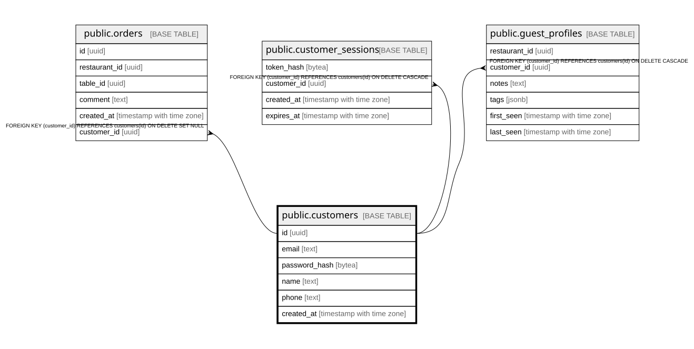

# public.customers

## Columns

| Name | Type | Default | Nullable | Children | Parents | Comment |
| ---- | ---- | ------- | -------- | -------- | ------- | ------- |
| id | uuid |  | false | [public.orders](public.orders.md) [public.customer_sessions](public.customer_sessions.md) [public.guest_profiles](public.guest_profiles.md) |  |  |
| email | text |  | false |  |  |  |
| password_hash | bytea |  | false |  |  |  |
| name | text |  | false |  |  |  |
| phone | text |  | true |  |  |  |
| created_at | timestamp with time zone | now() | false |  |  |  |

## Constraints

| Name | Type | Definition |
| ---- | ---- | ---------- |
| customers_pkey | PRIMARY KEY | PRIMARY KEY (id) |
| customers_email_key | UNIQUE | UNIQUE (email) |

## Indexes

| Name | Definition |
| ---- | ---------- |
| customers_pkey | CREATE UNIQUE INDEX customers_pkey ON public.customers USING btree (id) |
| customers_email_key | CREATE UNIQUE INDEX customers_email_key ON public.customers USING btree (email) |

## Relations

---

> Generated by [tbls](https://github.com/k1LoW/tbls)
