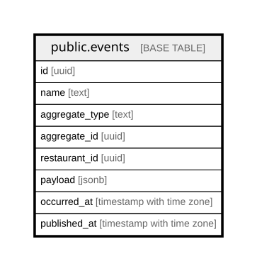

# public.events

## Columns

| Name | Type | Default | Nullable | Children | Parents | Comment |
| ---- | ---- | ------- | -------- | -------- | ------- | ------- |
| id | uuid |  | false |  |  |  |
| name | text |  | false |  |  |  |
| aggregate_type | text |  | false |  |  |  |
| aggregate_id | uuid |  | false |  |  |  |
| restaurant_id | uuid |  | true |  |  |  |
| payload | jsonb | '{}'::jsonb | false |  |  |  |
| occurred_at | timestamp with time zone | now() | false |  |  |  |
| published_at | timestamp with time zone |  | true |  |  |  |

## Constraints

| Name | Type | Definition |
| ---- | ---- | ---------- |
| events_pkey | PRIMARY KEY | PRIMARY KEY (id) |

## Indexes

| Name | Definition |
| ---- | ---------- |
| events_pkey | CREATE UNIQUE INDEX events_pkey ON public.events USING btree (id) |
| events_pending | CREATE INDEX events_pending ON public.events USING btree (occurred_at) WHERE (published_at IS NULL) |
| events_aggregate | CREATE INDEX events_aggregate ON public.events USING btree (aggregate_type, aggregate_id) |

## Relations

---

> Generated by [tbls](https://github.com/k1LoW/tbls)
