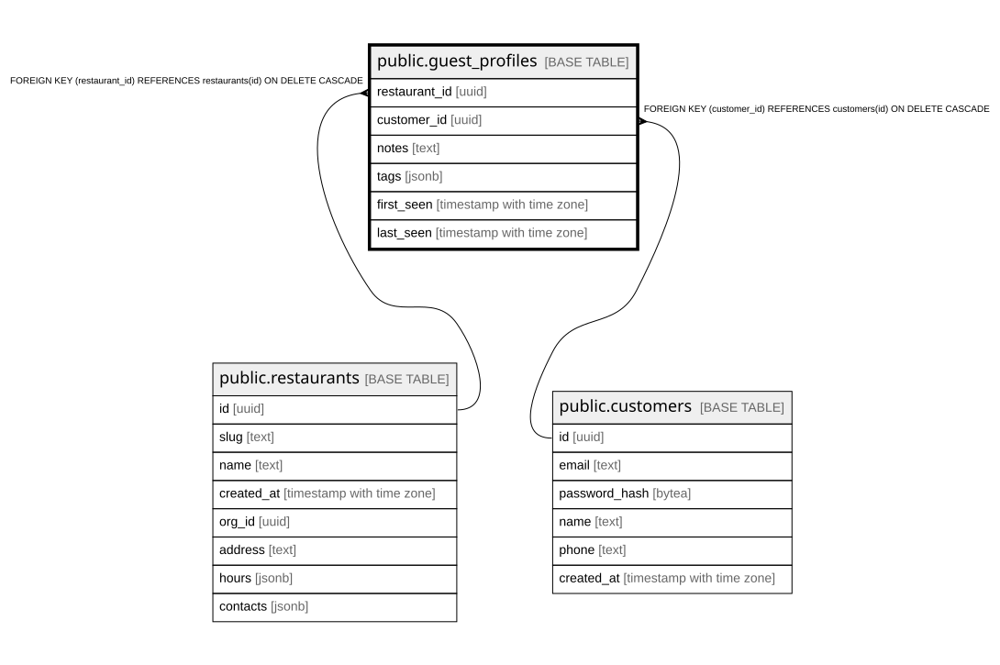

# public.guest_profiles

## Columns

| Name | Type | Default | Nullable | Children | Parents | Comment |
| ---- | ---- | ------- | -------- | -------- | ------- | ------- |
| restaurant_id | uuid |  | false |  | [public.restaurants](public.restaurants.md) |  |
| customer_id | uuid |  | false |  | [public.customers](public.customers.md) |  |
| notes | text | ''::text | false |  |  |  |
| tags | jsonb | '[]'::jsonb | false |  |  |  |
| first_seen | timestamp with time zone | now() | false |  |  |  |
| last_seen | timestamp with time zone | now() | false |  |  |  |

## Constraints

| Name | Type | Definition |
| ---- | ---- | ---------- |
| guest_profiles_restaurant_id_fkey | FOREIGN KEY | FOREIGN KEY (restaurant_id) REFERENCES restaurants(id) ON DELETE CASCADE |
| guest_profiles_customer_id_fkey | FOREIGN KEY | FOREIGN KEY (customer_id) REFERENCES customers(id) ON DELETE CASCADE |
| guest_profiles_pkey | PRIMARY KEY | PRIMARY KEY (restaurant_id, customer_id) |

## Indexes

| Name | Definition |
| ---- | ---------- |
| guest_profiles_pkey | CREATE UNIQUE INDEX guest_profiles_pkey ON public.guest_profiles USING btree (restaurant_id, customer_id) |

## Relations

---

> Generated by [tbls](https://github.com/k1LoW/tbls)
