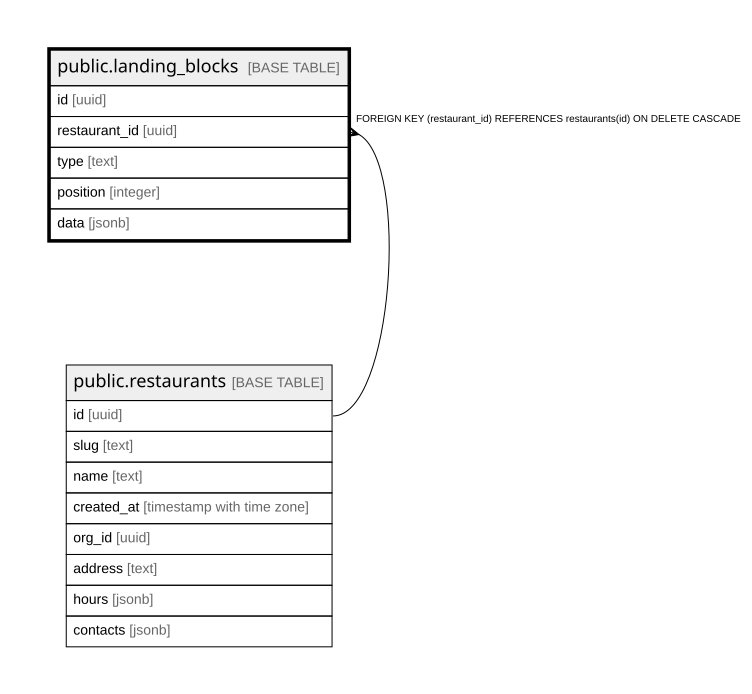

# public.landing_blocks

## Columns

| Name | Type | Default | Nullable | Children | Parents | Comment |
| ---- | ---- | ------- | -------- | -------- | ------- | ------- |
| id | uuid |  | false |  |  |  |
| restaurant_id | uuid |  | false |  | [public.restaurants](public.restaurants.md) |  |
| type | text |  | false |  |  |  |
| position | integer | 0 | false |  |  |  |
| data | jsonb | '{}'::jsonb | false |  |  |  |

## Constraints

| Name | Type | Definition |
| ---- | ---- | ---------- |
| landing_blocks_restaurant_id_fkey | FOREIGN KEY | FOREIGN KEY (restaurant_id) REFERENCES restaurants(id) ON DELETE CASCADE |
| landing_blocks_pkey | PRIMARY KEY | PRIMARY KEY (id) |

## Indexes

| Name | Definition |
| ---- | ---------- |
| landing_blocks_pkey | CREATE UNIQUE INDEX landing_blocks_pkey ON public.landing_blocks USING btree (id) |
| landing_blocks_restaurant_id_idx | CREATE INDEX landing_blocks_restaurant_id_idx ON public.landing_blocks USING btree (restaurant_id) |

## Relations

---

> Generated by [tbls](https://github.com/k1LoW/tbls)
