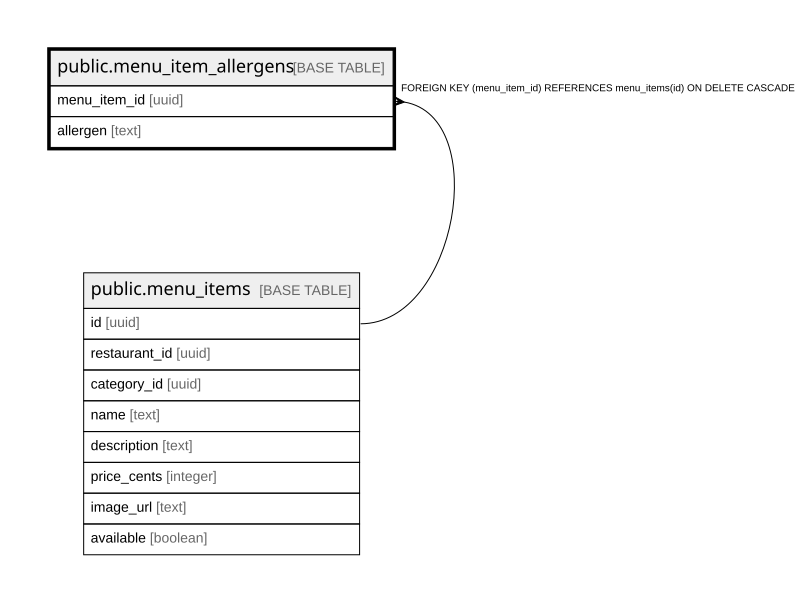

# public.menu_item_allergens

## Columns

| Name | Type | Default | Nullable | Children | Parents | Comment |
| ---- | ---- | ------- | -------- | -------- | ------- | ------- |
| menu_item_id | uuid |  | false |  | [public.menu_items](public.menu_items.md) |  |
| allergen | text |  | false |  |  |  |

## Constraints

| Name | Type | Definition |
| ---- | ---- | ---------- |
| menu_item_allergens_menu_item_id_fkey | FOREIGN KEY | FOREIGN KEY (menu_item_id) REFERENCES menu_items(id) ON DELETE CASCADE |
| menu_item_allergens_pkey | PRIMARY KEY | PRIMARY KEY (menu_item_id, allergen) |

## Indexes

| Name | Definition |
| ---- | ---------- |
| menu_item_allergens_pkey | CREATE UNIQUE INDEX menu_item_allergens_pkey ON public.menu_item_allergens USING btree (menu_item_id, allergen) |

## Relations

---

> Generated by [tbls](https://github.com/k1LoW/tbls)
