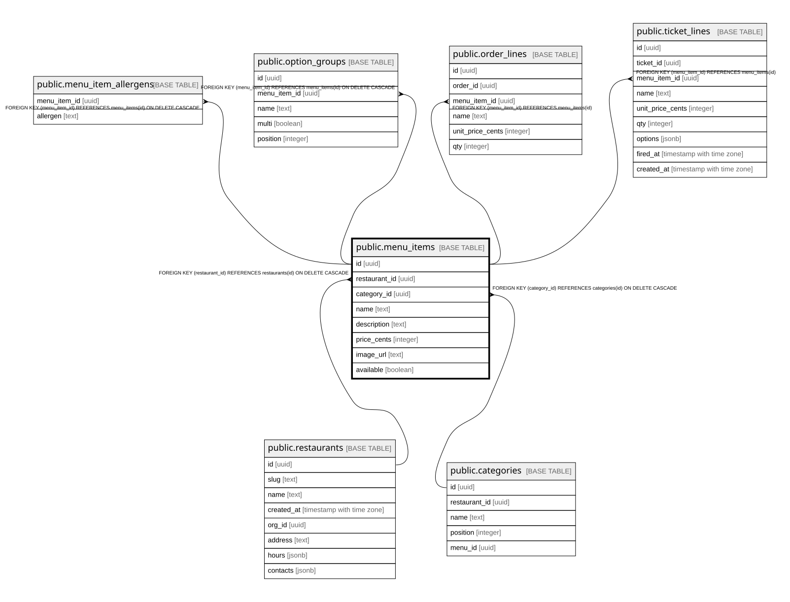

# public.menu_items

## Columns

| Name | Type | Default | Nullable | Children | Parents | Comment |
| ---- | ---- | ------- | -------- | -------- | ------- | ------- |
| id | uuid |  | false | [public.menu_item_allergens](public.menu_item_allergens.md) [public.option_groups](public.option_groups.md) [public.order_lines](public.order_lines.md) [public.ticket_lines](public.ticket_lines.md) |  |  |
| restaurant_id | uuid |  | false |  | [public.restaurants](public.restaurants.md) |  |
| category_id | uuid |  | false |  | [public.categories](public.categories.md) |  |
| name | text |  | false |  |  |  |
| description | text | ''::text | false |  |  |  |
| price_cents | integer |  | false |  |  |  |
| image_url | text | ''::text | false |  |  |  |
| available | boolean | true | false |  |  |  |

## Constraints

| Name | Type | Definition |
| ---- | ---- | ---------- |
| menu_items_restaurant_id_fkey | FOREIGN KEY | FOREIGN KEY (restaurant_id) REFERENCES restaurants(id) ON DELETE CASCADE |
| menu_items_category_id_fkey | FOREIGN KEY | FOREIGN KEY (category_id) REFERENCES categories(id) ON DELETE CASCADE |
| menu_items_pkey | PRIMARY KEY | PRIMARY KEY (id) |

## Indexes

| Name | Definition |
| ---- | ---------- |
| menu_items_pkey | CREATE UNIQUE INDEX menu_items_pkey ON public.menu_items USING btree (id) |
| menu_items_restaurant_id_idx | CREATE INDEX menu_items_restaurant_id_idx ON public.menu_items USING btree (restaurant_id) |
| menu_items_category_id_idx | CREATE INDEX menu_items_category_id_idx ON public.menu_items USING btree (category_id) |

## Relations

---

> Generated by [tbls](https://github.com/k1LoW/tbls)
