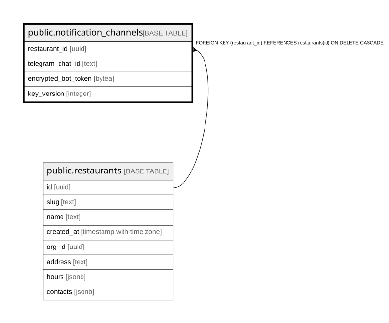

# public.notification_channels

## Columns

| Name | Type | Default | Nullable | Children | Parents | Comment |
| ---- | ---- | ------- | -------- | -------- | ------- | ------- |
| restaurant_id | uuid |  | false |  | [public.restaurants](public.restaurants.md) |  |
| telegram_chat_id | text | ''::text | false |  |  |  |
| encrypted_bot_token | bytea |  | false |  |  |  |
| key_version | integer |  | false |  |  |  |

## Constraints

| Name | Type | Definition |
| ---- | ---- | ---------- |
| notification_channels_restaurant_id_fkey | FOREIGN KEY | FOREIGN KEY (restaurant_id) REFERENCES restaurants(id) ON DELETE CASCADE |
| notification_channels_pkey | PRIMARY KEY | PRIMARY KEY (restaurant_id) |

## Indexes

| Name | Definition |
| ---- | ---------- |
| notification_channels_pkey | CREATE UNIQUE INDEX notification_channels_pkey ON public.notification_channels USING btree (restaurant_id) |

## Relations

---

> Generated by [tbls](https://github.com/k1LoW/tbls)
