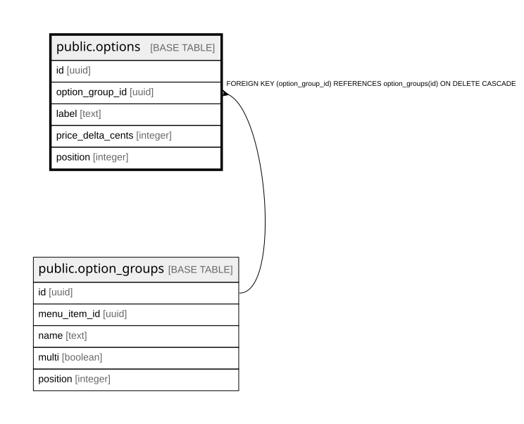

# public.options

## Columns

| Name | Type | Default | Nullable | Children | Parents | Comment |
| ---- | ---- | ------- | -------- | -------- | ------- | ------- |
| id | uuid |  | false |  |  |  |
| option_group_id | uuid |  | false |  | [public.option_groups](public.option_groups.md) |  |
| label | text |  | false |  |  |  |
| price_delta_cents | integer | 0 | false |  |  |  |
| position | integer | 0 | false |  |  |  |

## Constraints

| Name | Type | Definition |
| ---- | ---- | ---------- |
| options_option_group_id_fkey | FOREIGN KEY | FOREIGN KEY (option_group_id) REFERENCES option_groups(id) ON DELETE CASCADE |
| options_pkey | PRIMARY KEY | PRIMARY KEY (id) |

## Indexes

| Name | Definition |
| ---- | ---------- |
| options_pkey | CREATE UNIQUE INDEX options_pkey ON public.options USING btree (id) |
| options_option_group_id_idx | CREATE INDEX options_option_group_id_idx ON public.options USING btree (option_group_id) |

## Relations

---

> Generated by [tbls](https://github.com/k1LoW/tbls)
