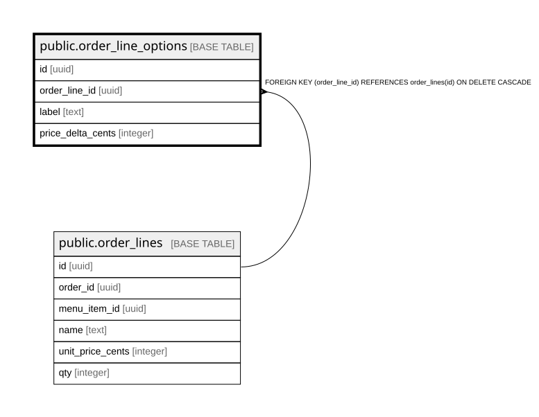

# public.order_line_options

## Columns

| Name | Type | Default | Nullable | Children | Parents | Comment |
| ---- | ---- | ------- | -------- | -------- | ------- | ------- |
| id | uuid |  | false |  |  |  |
| order_line_id | uuid |  | false |  | [public.order_lines](public.order_lines.md) |  |
| label | text |  | false |  |  |  |
| price_delta_cents | integer | 0 | false |  |  |  |

## Constraints

| Name | Type | Definition |
| ---- | ---- | ---------- |
| order_line_options_order_line_id_fkey | FOREIGN KEY | FOREIGN KEY (order_line_id) REFERENCES order_lines(id) ON DELETE CASCADE |
| order_line_options_pkey | PRIMARY KEY | PRIMARY KEY (id) |

## Indexes

| Name | Definition |
| ---- | ---------- |
| order_line_options_pkey | CREATE UNIQUE INDEX order_line_options_pkey ON public.order_line_options USING btree (id) |
| order_line_options_order_line_id_idx | CREATE INDEX order_line_options_order_line_id_idx ON public.order_line_options USING btree (order_line_id) |

## Relations

---

> Generated by [tbls](https://github.com/k1LoW/tbls)
