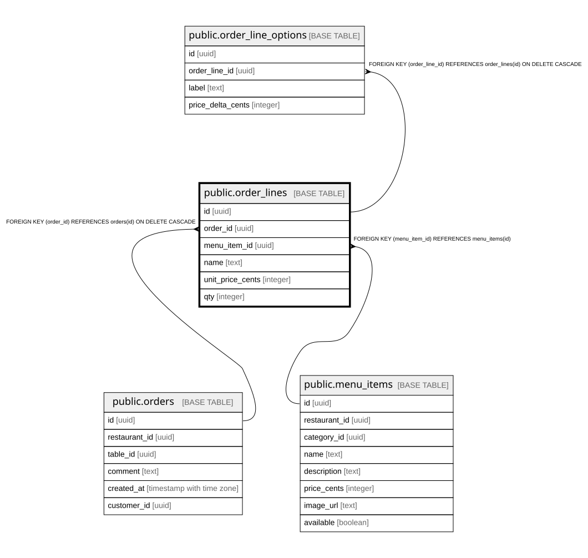

# public.order_lines

## Columns

| Name | Type | Default | Nullable | Children | Parents | Comment |
| ---- | ---- | ------- | -------- | -------- | ------- | ------- |
| id | uuid |  | false | [public.order_line_options](public.order_line_options.md) |  |  |
| order_id | uuid |  | false |  | [public.orders](public.orders.md) |  |
| menu_item_id | uuid |  | false |  | [public.menu_items](public.menu_items.md) |  |
| name | text |  | false |  |  |  |
| unit_price_cents | integer |  | false |  |  |  |
| qty | integer |  | false |  |  |  |

## Constraints

| Name | Type | Definition |
| ---- | ---- | ---------- |
| order_lines_menu_item_id_fkey | FOREIGN KEY | FOREIGN KEY (menu_item_id) REFERENCES menu_items(id) |
| order_lines_order_id_fkey | FOREIGN KEY | FOREIGN KEY (order_id) REFERENCES orders(id) ON DELETE CASCADE |
| order_lines_pkey | PRIMARY KEY | PRIMARY KEY (id) |

## Indexes

| Name | Definition |
| ---- | ---------- |
| order_lines_pkey | CREATE UNIQUE INDEX order_lines_pkey ON public.order_lines USING btree (id) |
| order_lines_order_id_idx | CREATE INDEX order_lines_order_id_idx ON public.order_lines USING btree (order_id) |

## Relations

---

> Generated by [tbls](https://github.com/k1LoW/tbls)
