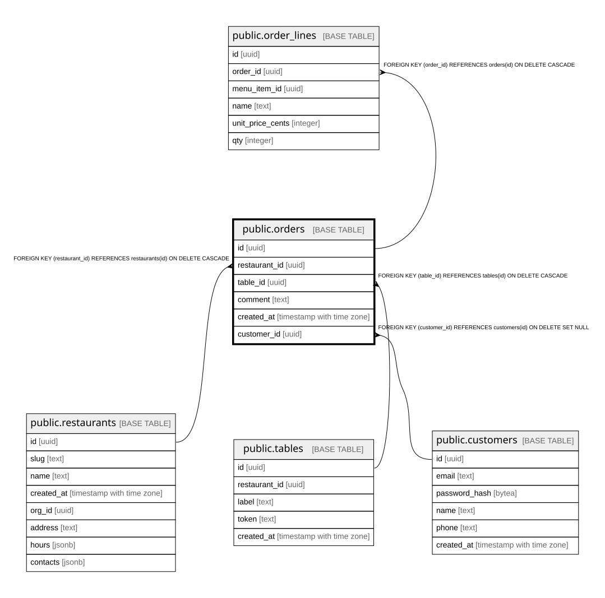

# public.orders

## Columns

| Name | Type | Default | Nullable | Children | Parents | Comment |
| ---- | ---- | ------- | -------- | -------- | ------- | ------- |
| id | uuid |  | false | [public.order_lines](public.order_lines.md) |  |  |
| restaurant_id | uuid |  | false |  | [public.restaurants](public.restaurants.md) |  |
| table_id | uuid |  | false |  | [public.tables](public.tables.md) |  |
| comment | text | ''::text | false |  |  |  |
| created_at | timestamp with time zone | now() | false |  |  |  |
| customer_id | uuid |  | true |  | [public.customers](public.customers.md) |  |

## Constraints

| Name | Type | Definition |
| ---- | ---- | ---------- |
| orders_restaurant_id_fkey | FOREIGN KEY | FOREIGN KEY (restaurant_id) REFERENCES restaurants(id) ON DELETE CASCADE |
| orders_table_id_fkey | FOREIGN KEY | FOREIGN KEY (table_id) REFERENCES tables(id) ON DELETE CASCADE |
| orders_pkey | PRIMARY KEY | PRIMARY KEY (id) |
| orders_customer_id_fkey | FOREIGN KEY | FOREIGN KEY (customer_id) REFERENCES customers(id) ON DELETE SET NULL |

## Indexes

| Name | Definition |
| ---- | ---------- |
| orders_pkey | CREATE UNIQUE INDEX orders_pkey ON public.orders USING btree (id) |
| orders_restaurant_id_idx | CREATE INDEX orders_restaurant_id_idx ON public.orders USING btree (restaurant_id) |
| orders_table_id_idx | CREATE INDEX orders_table_id_idx ON public.orders USING btree (table_id) |
| orders_customer_id_idx | CREATE INDEX orders_customer_id_idx ON public.orders USING btree (customer_id) WHERE (customer_id IS NOT NULL) |
| orders_restaurant_customer_idx | CREATE INDEX orders_restaurant_customer_idx ON public.orders USING btree (restaurant_id, customer_id) WHERE (customer_id IS NOT NULL) |

## Relations

---

> Generated by [tbls](https://github.com/k1LoW/tbls)
