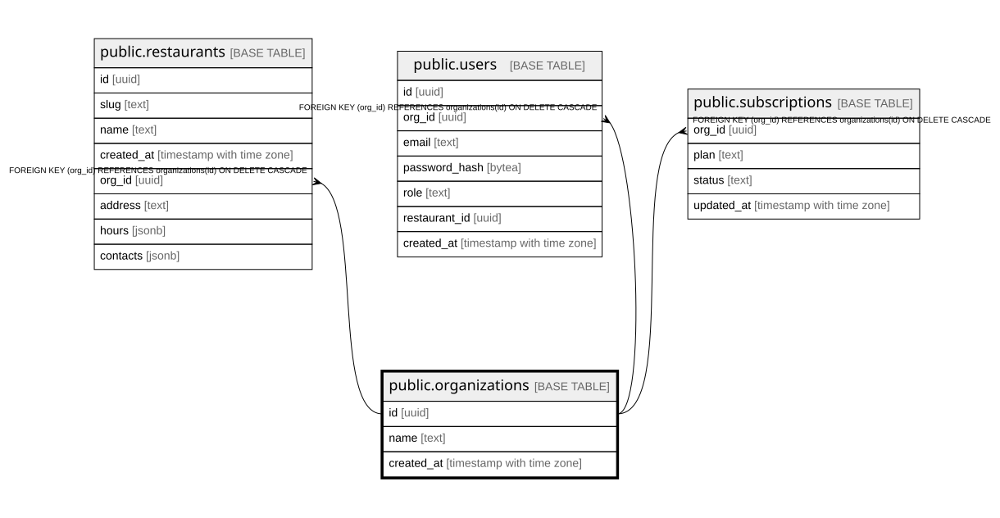

# public.organizations

## Columns

| Name | Type | Default | Nullable | Children | Parents | Comment |
| ---- | ---- | ------- | -------- | -------- | ------- | ------- |
| id | uuid |  | false | [public.restaurants](public.restaurants.md) [public.users](public.users.md) [public.subscriptions](public.subscriptions.md) |  |  |
| name | text |  | false |  |  |  |
| created_at | timestamp with time zone | now() | false |  |  |  |

## Constraints

| Name | Type | Definition |
| ---- | ---- | ---------- |
| organizations_pkey | PRIMARY KEY | PRIMARY KEY (id) |

## Indexes

| Name | Definition |
| ---- | ---------- |
| organizations_pkey | CREATE UNIQUE INDEX organizations_pkey ON public.organizations USING btree (id) |

## Relations

---

> Generated by [tbls](https://github.com/k1LoW/tbls)
