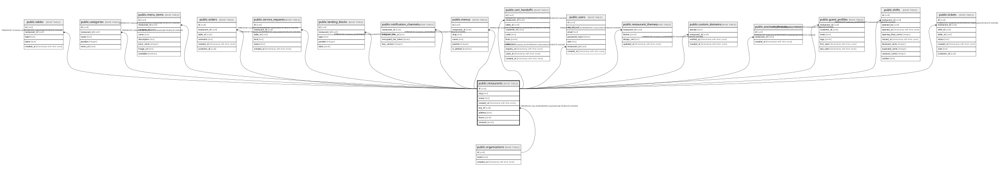

# public.restaurants

## Columns

| Name | Type | Default | Nullable | Children | Parents | Comment |
| ---- | ---- | ------- | -------- | -------- | ------- | ------- |
| id | uuid |  | false | [public.tables](public.tables.md) [public.categories](public.categories.md) [public.menu_items](public.menu_items.md) [public.orders](public.orders.md) [public.service_requests](public.service_requests.md) [public.landing_blocks](public.landing_blocks.md) [public.notification_channels](public.notification_channels.md) [public.menus](public.menus.md) [public.cart_handoffs](public.cart_handoffs.md) [public.users](public.users.md) [public.restaurant_themes](public.restaurant_themes.md) [public.custom_domains](public.custom_domains.md) [public.assistant_threads](public.assistant_threads.md) [public.guest_profiles](public.guest_profiles.md) [public.shifts](public.shifts.md) [public.tickets](public.tickets.md) |  |  |
| slug | text |  | false |  |  |  |
| name | text |  | false |  |  |  |
| created_at | timestamp with time zone | now() | false |  |  |  |
| org_id | uuid |  | true |  | [public.organizations](public.organizations.md) |  |
| address | text | ''::text | false |  |  |  |
| hours | jsonb | '[]'::jsonb | false |  |  |  |
| contacts | jsonb | '{}'::jsonb | false |  |  |  |

## Constraints

| Name | Type | Definition |
| ---- | ---- | ---------- |
| restaurants_pkey | PRIMARY KEY | PRIMARY KEY (id) |
| restaurants_slug_key | UNIQUE | UNIQUE (slug) |
| restaurants_org_id_fkey | FOREIGN KEY | FOREIGN KEY (org_id) REFERENCES organizations(id) ON DELETE CASCADE |

## Indexes

| Name | Definition |
| ---- | ---------- |
| restaurants_pkey | CREATE UNIQUE INDEX restaurants_pkey ON public.restaurants USING btree (id) |
| restaurants_slug_key | CREATE UNIQUE INDEX restaurants_slug_key ON public.restaurants USING btree (slug) |
| restaurants_org_id_idx | CREATE INDEX restaurants_org_id_idx ON public.restaurants USING btree (org_id) |

## Relations

---

> Generated by [tbls](https://github.com/k1LoW/tbls)
