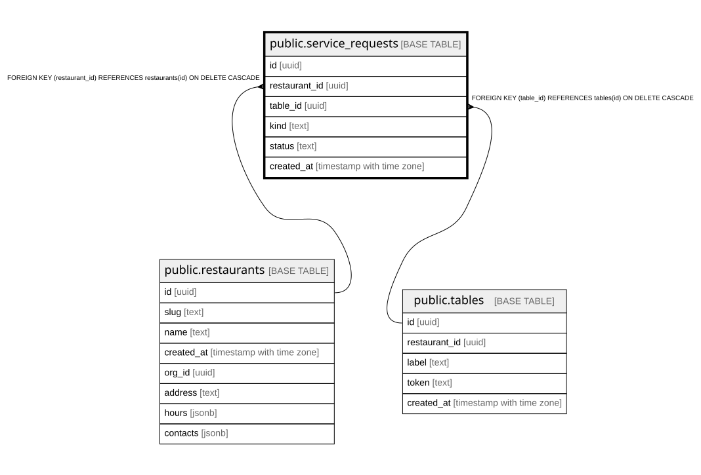

# public.service_requests

## Columns

| Name | Type | Default | Nullable | Children | Parents | Comment |
| ---- | ---- | ------- | -------- | -------- | ------- | ------- |
| id | uuid |  | false |  |  |  |
| restaurant_id | uuid |  | false |  | [public.restaurants](public.restaurants.md) |  |
| table_id | uuid |  | false |  | [public.tables](public.tables.md) |  |
| kind | text |  | false |  |  |  |
| status | text | 'pending'::text | false |  |  |  |
| created_at | timestamp with time zone | now() | false |  |  |  |

## Constraints

| Name | Type | Definition |
| ---- | ---- | ---------- |
| service_requests_restaurant_id_fkey | FOREIGN KEY | FOREIGN KEY (restaurant_id) REFERENCES restaurants(id) ON DELETE CASCADE |
| service_requests_table_id_fkey | FOREIGN KEY | FOREIGN KEY (table_id) REFERENCES tables(id) ON DELETE CASCADE |
| service_requests_pkey | PRIMARY KEY | PRIMARY KEY (id) |

## Indexes

| Name | Definition |
| ---- | ---------- |
| service_requests_pkey | CREATE UNIQUE INDEX service_requests_pkey ON public.service_requests USING btree (id) |
| service_requests_restaurant_id_idx | CREATE INDEX service_requests_restaurant_id_idx ON public.service_requests USING btree (restaurant_id) |
| service_requests_open_per_table_kind_idx | CREATE UNIQUE INDEX service_requests_open_per_table_kind_idx ON public.service_requests USING btree (table_id, kind) WHERE (status = 'pending'::text) |

## Relations

---

> Generated by [tbls](https://github.com/k1LoW/tbls)
