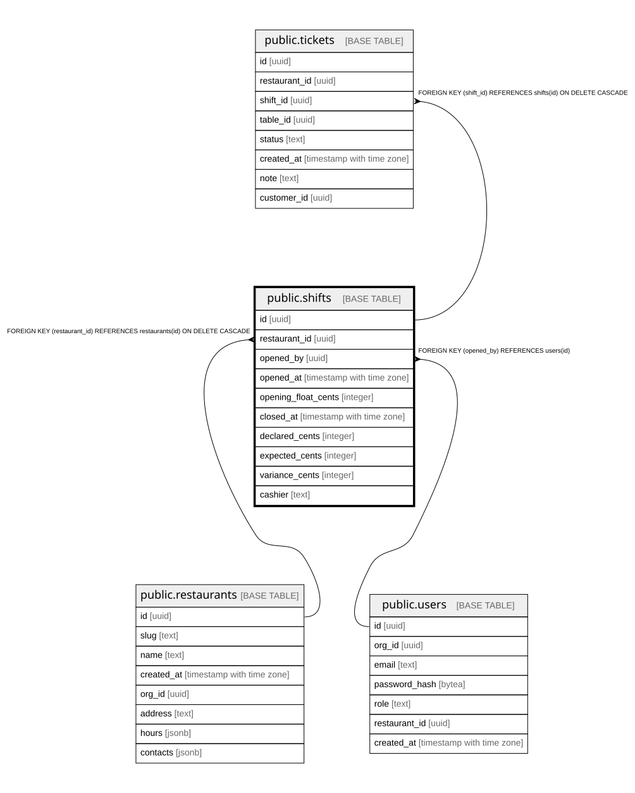

# public.shifts

## Columns

| Name | Type | Default | Nullable | Children | Parents | Comment |
| ---- | ---- | ------- | -------- | -------- | ------- | ------- |
| id | uuid |  | false | [public.tickets](public.tickets.md) |  |  |
| restaurant_id | uuid |  | false |  | [public.restaurants](public.restaurants.md) |  |
| opened_by | uuid |  | false |  | [public.users](public.users.md) |  |
| opened_at | timestamp with time zone | now() | false |  |  |  |
| opening_float_cents | integer |  | false |  |  |  |
| closed_at | timestamp with time zone |  | true |  |  |  |
| declared_cents | integer |  | true |  |  |  |
| expected_cents | integer |  | true |  |  |  |
| variance_cents | integer |  | true |  |  |  |
| cashier | text | ''::text | false |  |  |  |

## Constraints

| Name | Type | Definition |
| ---- | ---- | ---------- |
| shifts_restaurant_id_fkey | FOREIGN KEY | FOREIGN KEY (restaurant_id) REFERENCES restaurants(id) ON DELETE CASCADE |
| shifts_opened_by_fkey | FOREIGN KEY | FOREIGN KEY (opened_by) REFERENCES users(id) |
| shifts_pkey | PRIMARY KEY | PRIMARY KEY (id) |

## Indexes

| Name | Definition |
| ---- | ---------- |
| shifts_pkey | CREATE UNIQUE INDEX shifts_pkey ON public.shifts USING btree (id) |
| shifts_restaurant_id_idx | CREATE INDEX shifts_restaurant_id_idx ON public.shifts USING btree (restaurant_id) |
| shifts_open_per_restaurant_idx | CREATE UNIQUE INDEX shifts_open_per_restaurant_idx ON public.shifts USING btree (restaurant_id) WHERE (closed_at IS NULL) |

## Relations

---

> Generated by [tbls](https://github.com/k1LoW/tbls)
