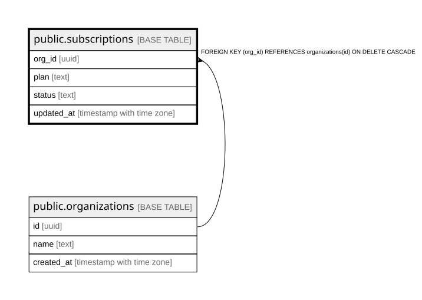

# public.subscriptions

## Columns

| Name | Type | Default | Nullable | Children | Parents | Comment |
| ---- | ---- | ------- | -------- | -------- | ------- | ------- |
| org_id | uuid |  | false |  | [public.organizations](public.organizations.md) |  |
| plan | text |  | false |  |  |  |
| status | text |  | false |  |  |  |
| updated_at | timestamp with time zone | now() | false |  |  |  |

## Constraints

| Name | Type | Definition |
| ---- | ---- | ---------- |
| subscriptions_org_id_fkey | FOREIGN KEY | FOREIGN KEY (org_id) REFERENCES organizations(id) ON DELETE CASCADE |
| subscriptions_pkey | PRIMARY KEY | PRIMARY KEY (org_id) |

## Indexes

| Name | Definition |
| ---- | ---------- |
| subscriptions_pkey | CREATE UNIQUE INDEX subscriptions_pkey ON public.subscriptions USING btree (org_id) |

## Relations

---

> Generated by [tbls](https://github.com/k1LoW/tbls)
