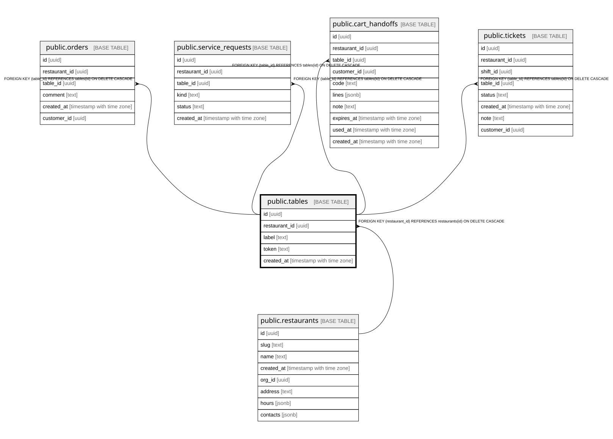

# public.tables

## Columns

| Name | Type | Default | Nullable | Children | Parents | Comment |
| ---- | ---- | ------- | -------- | -------- | ------- | ------- |
| id | uuid |  | false | [public.orders](public.orders.md) [public.service_requests](public.service_requests.md) [public.cart_handoffs](public.cart_handoffs.md) [public.tickets](public.tickets.md) |  |  |
| restaurant_id | uuid |  | false |  | [public.restaurants](public.restaurants.md) |  |
| label | text |  | false |  |  |  |
| token | text |  | false |  |  |  |
| created_at | timestamp with time zone | now() | false |  |  |  |

## Constraints

| Name | Type | Definition |
| ---- | ---- | ---------- |
| tables_restaurant_id_fkey | FOREIGN KEY | FOREIGN KEY (restaurant_id) REFERENCES restaurants(id) ON DELETE CASCADE |
| tables_pkey | PRIMARY KEY | PRIMARY KEY (id) |

## Indexes

| Name | Definition |
| ---- | ---------- |
| tables_pkey | CREATE UNIQUE INDEX tables_pkey ON public.tables USING btree (id) |
| tables_restaurant_id_token_idx | CREATE UNIQUE INDEX tables_restaurant_id_token_idx ON public.tables USING btree (restaurant_id, token) |
| tables_token_idx | CREATE UNIQUE INDEX tables_token_idx ON public.tables USING btree (token) |

## Relations

---

> Generated by [tbls](https://github.com/k1LoW/tbls)
