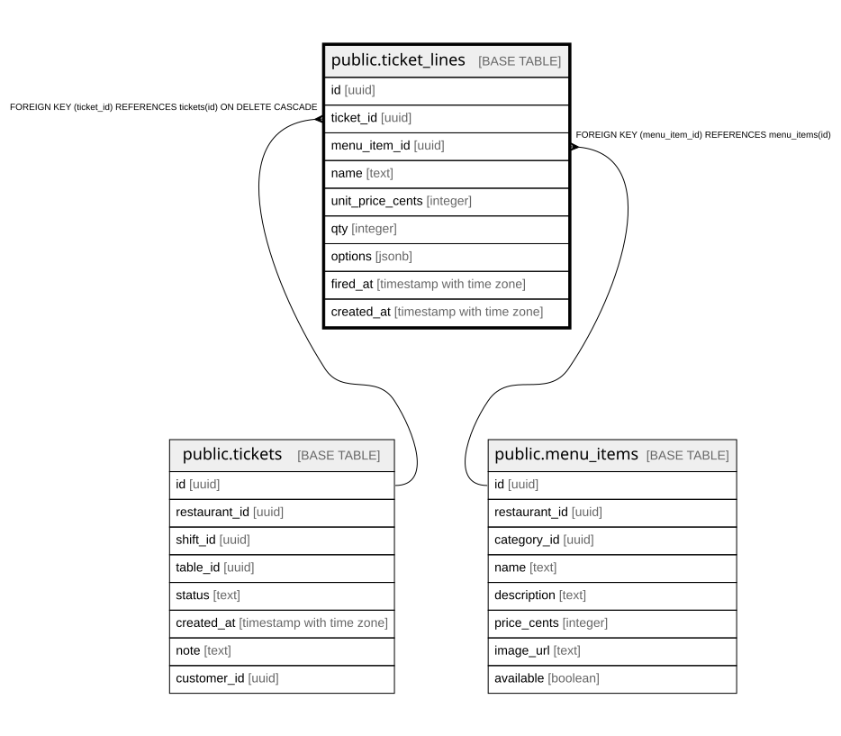

# public.ticket_lines

## Columns

| Name | Type | Default | Nullable | Children | Parents | Comment |
| ---- | ---- | ------- | -------- | -------- | ------- | ------- |
| id | uuid |  | false |  |  |  |
| ticket_id | uuid |  | false |  | [public.tickets](public.tickets.md) |  |
| menu_item_id | uuid |  | false |  | [public.menu_items](public.menu_items.md) |  |
| name | text |  | false |  |  |  |
| unit_price_cents | integer |  | false |  |  |  |
| qty | integer |  | false |  |  |  |
| options | jsonb | '[]'::jsonb | false |  |  |  |
| fired_at | timestamp with time zone |  | true |  |  |  |
| created_at | timestamp with time zone | now() | false |  |  |  |

## Constraints

| Name | Type | Definition |
| ---- | ---- | ---------- |
| ticket_lines_menu_item_id_fkey | FOREIGN KEY | FOREIGN KEY (menu_item_id) REFERENCES menu_items(id) |
| ticket_lines_ticket_id_fkey | FOREIGN KEY | FOREIGN KEY (ticket_id) REFERENCES tickets(id) ON DELETE CASCADE |
| ticket_lines_pkey | PRIMARY KEY | PRIMARY KEY (id) |

## Indexes

| Name | Definition |
| ---- | ---------- |
| ticket_lines_pkey | CREATE UNIQUE INDEX ticket_lines_pkey ON public.ticket_lines USING btree (id) |
| ticket_lines_ticket_id_idx | CREATE INDEX ticket_lines_ticket_id_idx ON public.ticket_lines USING btree (ticket_id) |

## Relations

---

> Generated by [tbls](https://github.com/k1LoW/tbls)
