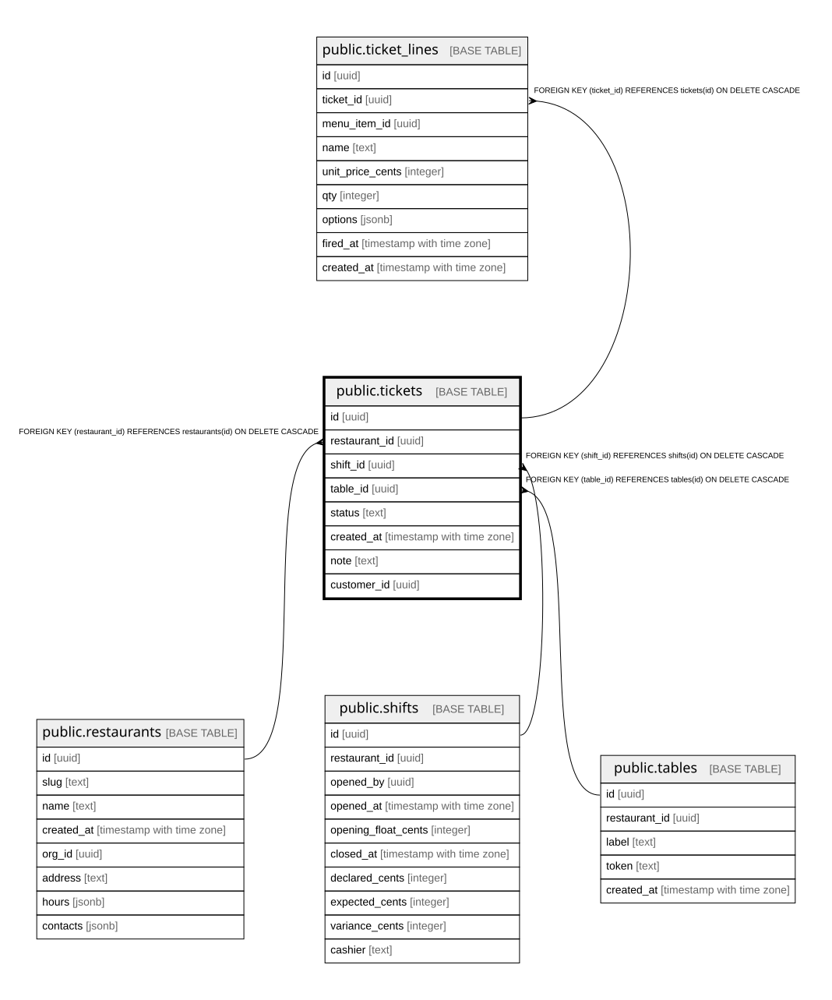

# public.tickets

## Columns

| Name | Type | Default | Nullable | Children | Parents | Comment |
| ---- | ---- | ------- | -------- | -------- | ------- | ------- |
| id | uuid |  | false | [public.ticket_lines](public.ticket_lines.md) |  |  |
| restaurant_id | uuid |  | false |  | [public.restaurants](public.restaurants.md) |  |
| shift_id | uuid |  | false |  | [public.shifts](public.shifts.md) |  |
| table_id | uuid |  | false |  | [public.tables](public.tables.md) |  |
| status | text | 'open'::text | false |  |  |  |
| created_at | timestamp with time zone | now() | false |  |  |  |
| note | text | ''::text | false |  |  |  |
| customer_id | uuid |  | true |  |  |  |

## Constraints

| Name | Type | Definition |
| ---- | ---- | ---------- |
| tickets_restaurant_id_fkey | FOREIGN KEY | FOREIGN KEY (restaurant_id) REFERENCES restaurants(id) ON DELETE CASCADE |
| tickets_table_id_fkey | FOREIGN KEY | FOREIGN KEY (table_id) REFERENCES tables(id) ON DELETE CASCADE |
| tickets_shift_id_fkey | FOREIGN KEY | FOREIGN KEY (shift_id) REFERENCES shifts(id) ON DELETE CASCADE |
| tickets_pkey | PRIMARY KEY | PRIMARY KEY (id) |

## Indexes

| Name | Definition |
| ---- | ---------- |
| tickets_pkey | CREATE UNIQUE INDEX tickets_pkey ON public.tickets USING btree (id) |
| tickets_restaurant_id_idx | CREATE INDEX tickets_restaurant_id_idx ON public.tickets USING btree (restaurant_id) |
| tickets_shift_id_idx | CREATE INDEX tickets_shift_id_idx ON public.tickets USING btree (shift_id) |
| tickets_open_per_table_idx | CREATE UNIQUE INDEX tickets_open_per_table_idx ON public.tickets USING btree (table_id) WHERE (status = 'open'::text) |
| tickets_restaurant_customer_idx | CREATE INDEX tickets_restaurant_customer_idx ON public.tickets USING btree (restaurant_id, customer_id) WHERE (customer_id IS NOT NULL) |

## Relations

---

> Generated by [tbls](https://github.com/k1LoW/tbls)
